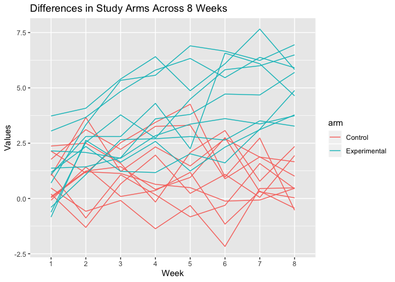
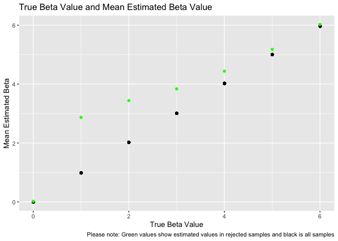

Homework 5
================
Holly Finertie
11/5/2019

## Problem 1

Replace missing values in iris\_with\_missing data set.

``` r
set.seed(10)

iris_with_missing = iris %>% 
  map_df(~replace(.x, sample(1:150, 20), NA)) %>%
  mutate(Species = as.character(Species))

update_missing = function(x) {
  
  if(is.numeric(x)) {
    replace(x, is.na(x), round(mean(x, na.rm = TRUE), digits = 1))
  }
  
  else if(!is.numeric(x)) {
    replace(x, is.na(x),"virginica")
  }
}

iris_no_missing = map_df(iris_with_missing, ~update_missing(.x))
```

Successfully updated `iris_with_missing` data set so that NA entries for
numerical variables were updated to the mean value and NA entries for
character variables were updated to “virginica”. The new data set
without NA values is called `iris_no_missing`.

## Problem 2

Import csv files for control and experimental groups in longitudinal
study. Then, show differences in values between arms across 8 weeks.

``` r
read_file = function(x) {
  
  y = read_csv(x)
  
}

source_df = tibble(
   file = list.files(path = "./data/"), 
   path = str_c("./data/", file))

longitudinal_study_df = source_df %>% 
  mutate(
    load = map(path, read_file)
  ) %>% 
  select(file, load) %>% 
  unnest(cols = load) %>% 
  pivot_longer(
    week_1:week_8, 
    names_to = "week",
    names_prefix = "week_", 
    values_to = "values"
  ) %>% 
  separate(file, into = c("arm", "observation"), sep = "_" ) %>% 
  mutate(
    observation = str_replace(observation, "\\.csv", ""), 
    arm = recode(arm, 
           con = "Control", 
           exp = "Experimental")
  )
 

study_plot = longitudinal_study_df %>% 
  group_by(observation) %>% 
  ggplot(aes(x = week, y = values, color = arm, group = arm)) + 
  geom_path() + 
  labs(
    title = "Differences in Study Arms Across 8 Weeks",
    x = "Week",
    y = "Values"
  ) 
  

study_plot
```

<!-- -->

#### Comment on Plot

The mean value for the control arm stayed roughly the same around 1.02
for 8 weeks while the mean value for the experiement arm increased from
1.14 in week 1 to 5.12 in week 8. Assuming an increase in values is a
good thing, the experimental group improved compared to the control
group over 8 weeks of treatment.

## Problem 3:

Show relationship between effect size and power using simple linear
regression.

``` r
set.seed(10)

linear_regression = function(n = 30, beta0 = 2, beta1, var = 50) {
  
  regression_data = tibble(
    x = rnorm(n, mean = 0, sd = 1),
    y = beta0 + beta1 * x + rnorm(n, 0, var^0.5)
  )
  
  lin_fit = lm(y ~ x, data = regression_data)
  
  tidy(lin_fit)

}

regression_results_test = 
  rerun(10000, linear_regression(beta1 = 0)) %>% 
  bind_rows() %>% 
  filter(term == "x") %>% 
  select(estimate, p.value)

regression_results = 
  tibble(beta1_true = c(0, 1, 2, 3, 4, 5, 6)) %>% 
  mutate(
    output_lists = map(.x = beta1_true, ~rerun(10000, linear_regression(beta1 = .x))),
    estimate_dfs = map(output_lists, bind_rows)) %>% 
  unnest(estimate_dfs) %>% 
  filter(term == "x") %>% 
  select(beta1_true, estimate, p.value) %>% 
  mutate(
    reject = case_when(
      p.value > 0.05 ~ "No",
      p.value <= 0.05 ~ "Yes",
      TRUE     ~ ""
  ))
  
power_and_effect = regression_results %>% 
  group_by(beta1_true) %>% 
  summarize(
    n_sig = sum(reject == "Yes"), 
    p_sig = n_sig/n()
  ) %>% 
  ggplot(aes(x = beta1_true, y = p_sig)) + 
  geom_point() +
  labs(
    title = "Association Between Power and Effect Size", 
    x = "True Value of Beta1", 
    y = "Power"
  )

power_and_effect
```

<!-- -->

Power is the probability of correctly rejecting the null hypothesis and
is directly related to effect size. As effect size increases, it becomes
“easier” to detect the difference between two groups and therefore
“easier” to correctly reject the null hypothesis. For this reason, as
effect size increases, so does the power. As expected, we see a positive
relationship between effect size and power in the graph above. At the
lowest value of beta (0), we only correctly reject the null about 5% of
the time; however, at the highest value of beta (6), we correctly reject
the null almost 100% of the time.

``` r
true_and_estimate = regression_results %>% 
  group_by(beta1_true) %>% 
  mutate(
    mean_beta = mean(estimate)
  ) 

true_and_rejected = regression_results %>% 
  group_by(beta1_true) %>% 
  filter(reject == "Yes") %>% 
  summarize(
    mean_beta = mean(estimate)
  ) 

overlaid_plot = 
  ggplot(true_and_estimate , aes(x = beta1_true, y = mean_beta)) + 
  geom_point() +
  geom_point(data = true_and_rejected, color = "green") + 
  labs(
    title = "True Beta Value and Mean Estimated Beta Value", 
    caption = "Please note: Green values show estimated values in rejected samples and black is all samples",
    x = "True Beta Value", 
    y = "Mean Estimated Beta"
  )

overlaid_plot
```

<!-- -->

#### Description of plot

In the above plot, we mapped the true beta value on the x axis and two
versions of the mean estimated beta on the y-axis: (1) the mean
estimated beta across all samples in black and (2) the mean estimated
beta in only the rejected samples in green. The mean estimated beta
across all samples is a much better estimate of the true beta value.
However, both versions are pretty accurate as the true beta value
increases.

#### Explanation

As described above, lower effect sizes are more difficult to estimate
due to low power. If we focus only on the sample that we rejected (green
values), we expect that the estimated values for the smaller effect
sizes will be less accurate compared to the estimated betas for the
effect sizes. Again, this is because it is much harder to accurately
estimate the true betas (differences between groups) when the effect
size is small.
